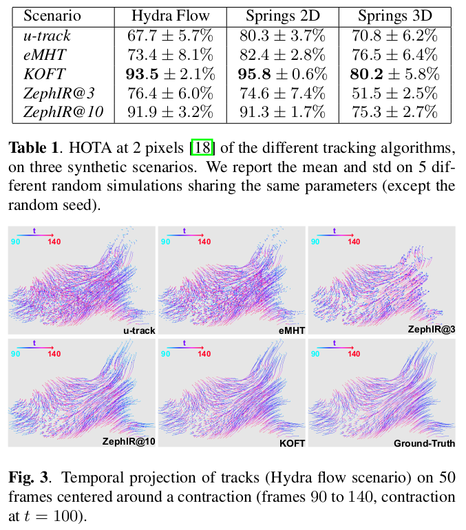

# SINETRA: SIngle NEuron TRAcking synthetic dataset
[](https://github.com/raphaelreme/sinetra/actions/workflows/tests.yml)


Code of the [paper](https://arxiv.org/abs/2411.09462) "SINETRA: a versatile framework for evaluating single neuron tracking in behaving animals", submitted at ISBI2025.

In this repository, you will find the `sinetra` python package that implements the simulator describe in the paper and the `tracking_src` python package that runs the tracking experiments done in the paper with the synthetic data.

Our simulator produces synthetic images of fluorescent cells in freely-behaving animals. It also produces the tracking ground truth of the particles. Motion of particles are either extracted from true fluorescence videos using optical flow (on the left) or generated from a physical-based simulation with springs (on the right).

## Install

First clone the repository and submodules

```bash
$ git clone git@github.com:raphaelreme/SINETRA.git
$ cd SINETRA
$ git submodule init
$ git submodule update  # It requires to connect with ssh to github
```

Install requirements

```bash
$ pip install -r requirements.txt
$
$ # If you want to run ZephIR experiments
$ # pip install -r ZephIR/requirements.txt
```

Additional requirements (Icy, Fiji) are needed to reproduce some tracking experiments. See the installation guidelines of [ByoTrack](https://github.com/raphaelreme/byotrack) for a complete installation.

The experiment configuration files are using environment variables that needs to be set:
- $ICY: path to icy.jar
- $FIJI: path to fiji executable

To download the Hydra video that we use in the paper, you can run:
```bash
$ bash scripts/download_hydra_video.sh  # Or download manually from https://partage.imt.fr/index.php/s/bgCFszkzYGFWgAz
```

See the `Troubleshooting` section for more informations on fixing your installation.

For users that only want to generate tracking data, we deployed the `sinetra` package. It allows to use the `Simulator` class or `main` function to generate the data from python directly in another project (for instance for very long video, one could create the video frame by frame and do the tracking at the same time, without storing the data). It can be installed with

```bash
$ pip install sinetra
```

## Dataset

Videos and ground truths used in the paper can be fully reproduced with the code and data provided here with:

```bash
$ # You have to download hydra data first
$ python scripts/paper_dataset.py  # /!\ It requires 30G of free space (3G for each 3d data and 0.5G for each 2d ones)
```

To extract optical flow on our Hydra Flow simulation, we used a fluorescence video of Hydra Vulgaris from Dupre C, Yuste R. Non-overlapping Neural Networks in Hydra vulgaris. Curr Biol. 2017 Apr 24;27(8):1085-1097. doi: 10.1016/j.cub.2017.02.049. Epub 2017 Mar 30. PMID: 28366745; PMCID: PMC5423359.

The 200 frames that we use in the paper should be downloaded from https://partage.imt.fr/index.php/s/bgCFszkzYGFWgAz or using our download script `scripts/download_hydra_video.sh`.

### Dataset structure

The dataset is stored in the `dataset` folder. For each data_name (hydra_flow, springs_2d, springs_3d, or your owns) and each random seed (111, 222, 333, 444, 555, or your owns), it saves the video and the tracking ground truth inside the folder `dataset/{data_name}/{seed}` with the following structure:

```
dataset/{data_name}/{seed}/video.tiff  # The video in tiff format (T, [Z, ], Y, X) in uint8
                          /video_data.pt  # PyTorch dict containing all the ground truth informations
                          /tracks/0001.tiff  # Tracks images following CTC format
                                  ...        # Each tiff is a [Z, ], Y, X uint16 image, where 0 is the background and i != 0 a track_id
                                  0200.tiff
```

#### Video

The video is stored as `video.tiff`. It is a 3 or 4 dimensional uint8 image (T, [Z, ], Y, X).
Loading the video can be done with any software supporting tiff files.

Example in python:
```python
import byotrack

video = byotrack.Video("dataset/{data_name}/{seed}/video.tiff")
video[0]  # np.ndarray[np.uint8] of shape ([Z, ], Y, X, 1)
```

#### Tracking ground truth
Ground truth are stored in two ways. Using pytorch in `video_data.pt` (but this can only be loaded through python and pytorch) and in tiff images for each frame in the `tracks` folder.

`video_data.pt` is a dictionnary containing the simulaions tensors of the ground truth particles:
```
{
    "mu": , // Tensor of shape (T, N, d) representing the positions of the N particles in d-dimensions for all the frames
    "std": , // Tensor of shape (T, N, d) representing the stds of the particles ellipse along each axis (before rotation)
    "theta": , // Tensor of shape (T, N, 1 or 3) representing the rotation angle(s) of the particles
    "weight": , // Tensor of shape (T, N) representing the intensity weights of the particles
}
```

It allows to access the internal data of the simulator, but for practical use, only the positions `mu` should be used
Example in python (only):
```python
import torch

gt_positions = torch.load("dataset/{data_name}/{seed}/video_data.pt", weights_only=True)
gt_positions.shape  # T, N, d
```


`tracks` folder stores for each frame $t$ the ground truth segmentation of tracks as 2d or 3d uint16 images in the tiff format.
Tracks have unique positive identifiers $i$ and 0 represents the background. They can be loaded using any softwares supporting tiff files.

Example in python:
```python
import byotrack

segmentation_video = byotrack.Video("dataset/{data_name}/{seed}/tracks")

# Get the mask of tracks 5 in all the frames
masks = []
for segmentation in segmentation_video:
    masks.append(segmentation_video[0][..., 0] == 5)  # Shape: ([Z, ], Y, X)
```

## Reproduce (ISBI 2025)

We provide scripts to generate the same dataset that we used and run the same experiments

```bash
$ python scripts/paper_dataset.py  # Generate the dataset (Replace the older one if already generated)
$ python scripts/paper_track.py  # Launch tracks experiments
$ python scripts/aggregate_results.py  # Check tracking results
```

## Tracking results on the original dataset



Note: *u-track* in the paper corresponds to the results of *trackmate-kf* in the code.

## Build your own dataset

Our dataset may not reproduce your own particular experimental data in terms of motions or imaging noise. We present here the main hyperparameters and how to tune them to generate faithful synthetic data.

### Shape of the video
```yaml
n_frames: 200  # Number of frames to generate
simulator:
  shape:  # Size (2D or 3D) of the [Z, ] Y and X axes
    - 1024
    - 1024
```

### Parametring particles and background

```yaml
simulator:
  particles:
    min_std: 1.0  # The std of each axis of the particle ellipse is sampled uniformly in [1.0, 3.0]
    max_std: 3.0
    min_dist: 3.0  # Sample particles with at least 3 mahalanobis distance
    n: 1000  # n particles sampled, but many are filtered out leading to around ~800 particles.
  background:   
    min_std: 20.0  # Large background profiles (larger than particles) 
    max_std: 60.0
    min_dist: 0.15  # Allow overlap between background profiles
    n: 400

```

### Parametring imaging noises

```yaml
simulator:
  imaging_config:
    # Integration time for the poisson shot noise, typical values between [5 to 500]
    # It can be ~measured experimentally on experimental videos, by selecting a homogenous roi (homogenous in time or space or both). # And dividing its avg intensity by its variance (D = E / V)
    # Or set manually so that the noise visually matches experimental videos
    delta: 50.0
    # Proportion of particles over background signal: I = alpha P + (1-alpha) B
    # Typical values are in [0, 1] (below 0.2 particles are very hard to distinguish from the background)
    # At 1 there is no background.
    #
    # It can be ~measured experimentally on experimental videos using a coarse segmentation/ROI of the particles.
    # One can compute for each luminous particles i the avg intensity I_i and the avg intensity of its neighboring background J_i.
    # Assuming P_i = 1 in the particle and 0 outside and that the background is constant in I_i and J_i, we have
    # J_i = (1-alpha) B_i and I_i = alpha + (1 - alpha) B_i = alpha + J_i. => alpha = I_i - J_i (or avg on several particles i)
    # 
    # Or it can be set manually so that the background/particles luminosity visually matches experimental videos.
    alpha: 0.2

```

### Parametring motions

#### Optical flow based motion
First check that the optical flow is able to capture the motion in your video. The simplest way to do this using ByoTrack is:

```python
import byotrack

# Import your video and optical flow using ByoTrack standards as done in
# sinetra packages (see optical_flow module and simulator.VideoConfig class)
video = ...
optflow = ...

byotrack.InteractiveFlowVisualizer(video, optflow).run()
```

Then set the configuration with (the default hydra_flow.yml does this already)

```yaml
simulator:
  motions:
    - shape_variation  # Allow variation particles stds
    - local_rotation  # Allow variation of particles angles
    - flow_motion  # Optical flow motion
  shape_variation:
    noise: 0.05  # ~ 5% size std (in proportion)
  local_rotation:
    noise: 0.1  # ~ 5° angle std (pi / 30)
  flow_motion:
    # Set the parameters to rebuild your own optical flow (or the default farneback one)
    # It may requires to modify sinetra.optical_flow module.
    algorithm: farneback
    downscale: 4
    farneback:
      win_size: 20

  # Set the parameters to use the correct experimental video segment
  base_video:
    path: path/to/video
    transform:  # Normalize and aggregate channels
      aggregate: True
      normalize: True
      q_min: 0.02
      q_max: 0.997
      smooth_clip: 1.0

    # Select the temporal segment to use in the video
    start: 800
    stop: 1000  # Once stop is reached, it reads the video backward up to start and so on
    step: 1

    # Allow to randomly flip x, y or t axes and start at a random frame in the chosen segment
    randomize: True

```

#### Springs-based motion

```yaml
simulator:
  motions:
    - shape_variation  # Allow variation particles stds
    - local_rotation  # Allow variation of particles angles
    - elastic_motion  # Use springs-based motion
  shape_variation:
    noise: 0.05  # ~ 5% size std (in proportion)
  local_rotation:
    noise: 0.1  # ~ 5° angle std (pi / 30)
  elastic_motion:
    period: 50.0  # Period of the springs (2 pi / w0) = 2pi tau in the paper
    # Grid step of the control points, add more points to build more rigid and local structure
    # We found that using few control points (around 30) was giving the best motions for us
    # with a grid step of 100 in 2D and 30 in 3D.
    grid_step: 100
    noise:
    name: contraction
    contraction:
      motion_rate: 40.0  # Number of random motions by frame
      motion_size: 10  # Max size of the motion
      amplitude: 30.0  # times w0 ~ 0.125 to get the real amplitude in pixels: ~ 4pixels
  global_motion:  # Add global drift and rotation (optional)
    noise_position: 30.0  # ~ 30 pixels std (the animals moves globally and randomly)
    noise_theta: 0.15  # ~ 8° angle std

```

### Building the dataset

You can either modify the parameters inside a yaml config file as it is done in the `configs` folder. Or choose the closest existing config
and modify parameters in the `expyrun` command line. (Or do both, see how this is done in the `scripts` folder.)

For instance, this would create a dataset based on the `springs_2d` configuration, but reducing the shape of the simulation:

```bash
$ # The video and tracks are stored in dataset/my_new_dataset/666
$ expyrun configs/dataset/springs_2d.yml --name my_new_dataset --seed 666 --simulator.shape 500,700
```

## Troubleshooting

The code was developped on Ubuntu with conda and python=3.10 (but it should work on any platform/recent python version). Please raise an issue if the code is not working on your particular case.

If you face an error, we advise to run the following commands to better see the logs (instead of the provided `scripts`):

```bash
$ # To test the simulator  (It will try (re)generate dataset/springs_2d/111)
$ expyrun configs/dataset/springs_2d.yml  # You can try to generate hydra_flow.yml or springs_3d.yml instead of springs_2d.yml
$
$ # For the tracking experiments
$ expyrun configs/tracking/track.yml --tracking_method koft  # You can try each tracking method one by one (koft, trackmate, emht, zephir)
```

If you face warnings from pytorch or numba (or other external dependencies), try to fix the warnings, it may solve most of your issues.

## Cite us

If you use this work, please cite our [preprint](https://arxiv.org/abs/2411.09462):

```bibtex
@misc{reme2024sinetraversatileframeworkevaluating,
      title={SINETRA: a Versatile Framework for Evaluating Single Neuron Tracking in Behaving Animals},
      author={Raphael Reme and Alasdair Newson and Elsa Angelini and Jean-Christophe Olivo-Marin and Thibault Lagache},
      year={2024},
      eprint={2411.09462},
      archivePrefix={arXiv},
      primaryClass={cs.CV},
      url={https://arxiv.org/abs/2411.09462},
}
```
